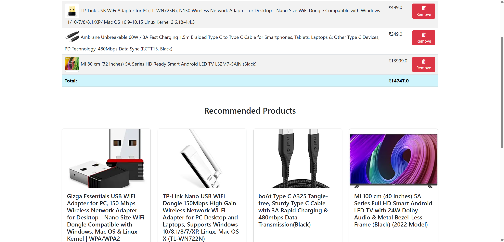

# 🛒 Amazon Product Recommendation System

This project develops a product recommendation system using data from over 1,000 Amazon products, including ratings and reviews listed on Amazon's official website. The project covers data analysis, data modeling, and web interface development.

## 🎯 Project Objective

The primary goal of this project is to enhance the e-commerce experience by recommending similar and relevant products to users based on the items they add to their shopping cart. This improves user engagement and maximizes sales potential.

## 🛠️ Technologies Used

- **📝 Python**: Data analysis, modeling, and backend operations
- **🐼 Pandas**: Data manipulation and analysis
- **📊 NumPy**: Numerical computing
- **📈 Matplotlib**: Data visualization
- **🤖 Scikit-learn**: Machine learning algorithms (TF-IDF and Cosine Similarity)
- **🌐 Flask**: Web application development
- **🎨 Bootstrap**: Frontend design and styling

## 📦 Dataset

- **Source**: Official Amazon website
- **Content**:
- product_id - Product ID
- product_name - Name of the Product
- category - Category of the Product
- discounted_price - Discounted Price of the Product
- actual_price - Actual Price of the Product
- discount_percentage - Percentage of Discount for the Product
- rating - Rating of the Product
- rating_count - Number of people who voted for the Amazon rating
- about_product - Description about the Product
- user_id - ID of the user who wrote review for the Product
- user_name - Name of the user who wrote review for the Product
- review_id - ID of the user review
- review_title - Short review
- review_content - Long review
- img_link - Image Link of the Product
- product_link - Official Website Link of the Product

## 📝 Project Workflow

### 1️⃣ Data Preprocessing
- Checking and cleaning missing data
- Selecting necessary columns
- Normalizing and transforming data

### 2️⃣ Exploratory Data Analysis (EDA)
- Visualizing data distribution (Matplotlib)
- Analyzing ratings and reviews

### 3️⃣ Modeling
- Converting text data into numerical format using **TF-IDF Vectorizer**
- Calculating product similarity with **Cosine Similarity**
- Recommending similar products based on user cart contents

### 4️⃣ Web Application
- Backend development with Flask
- User-friendly interface design with Bootstrap
- Adding products to the cart and displaying recommendations

## 🚀 How to Run the Project

### Prerequisites
```bash
pip install -r requirements.txt
```

### Start the Application
```bash
python app.py
```

### Web Interface Usage
- Browse products on the homepage
- Add products to the cart
- Get product recommendations based on cart contents

## 🖼️ Project Screenshots

### 🏠 Homepage


### 🛍️ Products


### 🏷️ Product Detail


### 🛒 Cart Page & Product Recommendations





## 📬 Contact
**Hasan Can Çelik**  
[🐙 GitHub](https://github.com/HasanCan6241)  
[💼 LinkedIn]([https://www.linkedin.com/in/hasancancelik/](https://www.linkedin.com/in/hasan-can-%C3%A7elik-46950623b))  
[📧 E-mail](mailto:hasancan.celik6241@gmail.com)

